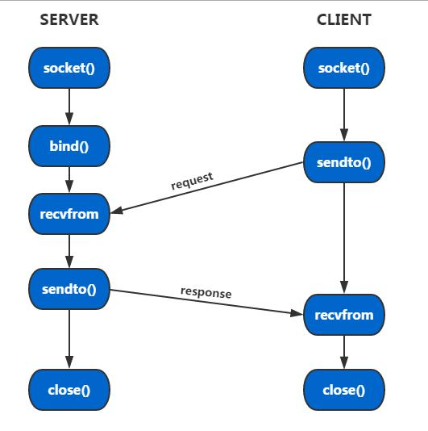

# 作业一

作业要求竟然是udp? 



> [references](https://www.cnblogs.com/skyfsm/p/6287787.html)

## notes

```c
//sendto():
sendto(s, str, strlen(str)+1, 0,(struct sockaddr*)&clnt_addr, clnt_addr_size);//最后一个参数不是指针，因为不需要改

//recvfrom():
recvfrom(s, buffer, 512, 0, (struct sockaddr *)&server_addr, &len);
```

