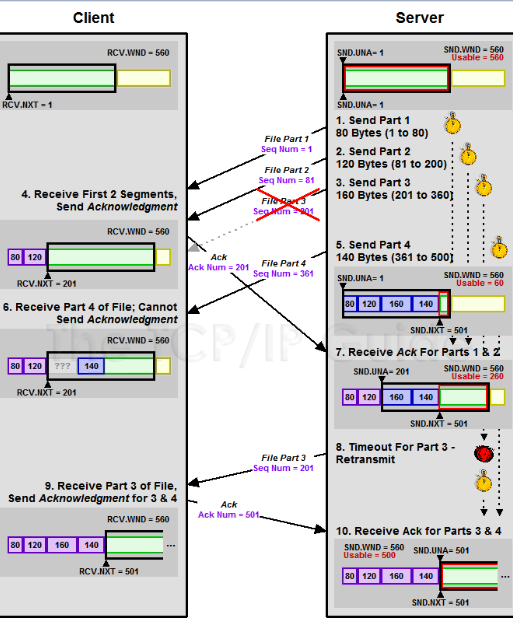

# 作业一：[简单的client-server程序](https://github.com/Hughshine/very-simple-network-programming-demos)

[TOC]

## 作业要求

* 基本要求：
  - [x] 使用c/c++，原生socket库
  - [x] 使用udp实现
  - [x] 服务器对客户发来的“Time”或“Date”请求进行回应

* 实现的额外内容：
  - [x] 更好的封装
  - [x] 使用tcp实现基本要求
  - [x] python的socket编程探索（tcp/udp）
  - [x] 可靠重传机制构想

## 实验说明

由于在mac上编程，因而使用linux库中的socket。

```c++
#include<sys/socket.h>
```

且由于没有学过基于c/c++的可视化编程，所以目标为实现`command line interface`。

## 实验内容

### 0. 目录结构

```shell
.
├── README.md
├── TCP  # python 实现TCP
│   ├── TCPClient.py
│   └── TCPServer.py
├── UDP  # python 实现UDP
│   ├── UDPClient.py
│   └── UDPServer.py
├── simple-cpp-tcp-client-server  # c++ 实现tcp
│   ├── README.md
│   ├── client
│   │   ├── client.cpp
│   │   ├── client.h
│   │   ├── client.out
│   │   ├── compile.sh
│   │   └── main.cpp
│   ├── recompile.sh
│   ├── server
│   │   ├── compile.sh
│   │   ├── main.cpp
│   │   ├── server.cpp
│   │   ├── server.h
│   │   └── server.out
│   ├── start.sh
│   └── tcp.gif
└── simple-cpp-udp-client-server  # c++ 实现tcp
    ├── README.md
    ├── client
    │   ├── client.cpp
    │   ├── client.h
    │   ├── client.out
    │   ├── compile.sh
    │   └── main.cpp
    ├── recompile.sh
    ├── server
    │   ├── compile.sh
    │   ├── main.cpp
    │   ├── server.cpp
    │   ├── server.h
    │   └── server.out
    ├── start.sh
    └── udp.jpg
```

### 1. udp实现预期功能（基础功能）

一图胜千言：


#### `client`

##### `cli`

假设可执行文件名为`./client.out`，预期调用方式为：
```shell
./client.out  # 使用默认的目标ip与目标端口
./client.out <ip> <port>  # 手动传入目标ip与端口
```

使用时一般提示如下。`ctrl+D`（EOF）可以直接退出程序。
```
Client targets at ip: 127.0.0.1, with port: 12003
Key in your cmd to the server: Date
Message form server: 2019-10-25
Key in your cmd to the server: Time
Message form server: 15:57:58
Key in your cmd to the server: date
Message form server: Sorry, wrong command.
```

源码为以下。从`argv[]`中获取命令行参数，给出相应的提示，并确定`client`配置。
```cpp
int main(int argc,char *argv[]) //增加可以读取terminal参数
{
	string ip = "127.0.0.1";
	unsigned int port = 12003;
	client c = client("127.0.0.1", 12003);
	if (argc == 3)
	{
		string ip(argv[1]); 
		int port = atoi(argv[2]); 
		c.reset(ip, port);
	} else if(argc != 1) {
		string name(argv[0]);
		cout<<" ------------- Wrong args format ------------ "<<endl;
        cout<<" ------- Usage: "<<name<<" <ip> <port> ------ "<<endl;
        cout<<" ---------  Now, using default config-------- "<<endl;
	} 
		cout<<"Client targets at ip: "<<ip<<", with port: "<<port<<endl;
	//EOF (Ctrl + D 结束运行。)
	while(true) {
		cout<<"Key in your cmd to the server: ";
		string cmd;
		cin>>cmd;
		if (cmd == "")
		{
			cout<<"EOF, exiting...\n";
			return 0;
		}
		c.sendCmd(cmd);
	}
}
```

##### `class` design

client类设计。初始化时传入目标ip与目标port进行配置，并在后续需要时创建`socket`，修改配置，发送指令。
```c++
class client
{
public:
	client(string target_ip, unsigned target_port);

	int createSocket();

	int sendCmd(string cmd);

	int reset(string target_ip, unsigned target_port);
private:
	int set(string target_ip, unsigned target_port);

	void error(const char *m);

	int s;

	string target_ip;

	unsigned target_port;

	struct sockaddr_in server_addr;

	char* buffer;
};
```

##### `config`

以下三个函数与client配置有关。构造函数与`reset`函数调用私有的设置函数，初始化结构体`struct sockaddr_in server_addr`。主要包括设置访问方式为`ipv4`，ip为传入的ip，目标port为传入的port。该结构体实例将在`socket`发包时使用。

```cpp
/* public */
client::client(string target_ip, unsigned target_port){
	set(target_ip, target_port);
}
int client::reset(string target_ip, unsigned target_port){
	set(target_ip, target_port);
	return 0;
}
/* private */
int client::set(string target_ip, unsigned target_port) {
	this->target_ip = target_ip;
	this->target_port = target_port;
	memset(&server_addr, 0, sizeof(server_addr));
	server_addr.sin_family = AF_INET;
	server_addr.sin_addr.s_addr = inet_addr(target_ip.c_str());
	server_addr.sin_port = htons(target_port);
	return 0;
}

```

##### `socket`

client的socket创建过程只需要在设置好属性后，随机选择一个port就可以了。系统会自己选。

```cpp
int client::createSocket(){
	// Create socket at a random port.
	this->s = socket(AF_INET, SOCK_DGRAM, IPPROTO_UDP);
	if (s < 0) { error("socket()"); }
	return 0;
}
```

##### `sendCmd`

得到键盘输入的命令后，调用sendto发包。

```cpp
/**
 * 参数说明：
 * - s 为socket
 * - buf 为要数据报缓存地址。
 * - len 为数据报长度。实际调用时，使用了strlen(cmd.c_str())+1，原因是要加末尾一位的'\0'。
 * - flags 一般使用0，此处不加深究。
 * - tolen 为对方地址长度。
 * * 返回值为实际传送的字符数，若失败返回-1。
 */
int sendto (int s, const void *buf, int len, unsigned int flags, const struct sockaddr *to, int tolen);
```

```cpp
int client::sendCmd(string cmd=""){
	createSocket();
	sendto(s, cmd.c_str(), strlen(cmd.c_str())+1, 0, (struct sockaddr *)&server_addr, sizeof(server_addr));
	socklen_t len;
	recvfrom(s, buffer, 512, 0, (struct sockaddr *)&server_addr, &len);
	cout<<"Message form server: "<<buffer<<endl;
	close(s);
	return 0;
}
```

##### `error`

对于正确的程序，client发udp包基本不会出现error的情况，socket也只需随机bind一个port。但代码中也做了基础的检查。socket为正时才是正确的。

```cpp
void client::error(const char *m){
	perror(m);  // 输出错误信息到stderr
}
```

#### `server`

##### `cli`

使用方式与client相似。额外对server可能的bind失败错误进行了处理。错误原因一般是端口占用。

```cpp
    //...
    int bindcode = s.bindSocket();
    if (!bindcode)
    {
        while(true){

            cout<<"try again? y/n."<<endl;
            string cmd;
            cin>>cmd;
            if (cmd != "y")
            {
                cout<<"Bye..."<<endl;
                return 0;;
            }
            bindcode = s.bindSocket();
        }
    }
    s.dealWithRequests();
    //...
```

预期的server log如下。

```s
Server will serve at ip: 127.0.0.1:12003
socket: 3
 --------- Trying to bind socket, attempts: 1/10. --------- 
 --------- Bind success!!! --------- 
Client IP: 127.0.0.1
Client port: 53448
Command from client: Date
Request time: 2019-10-25 16:26:53
Callback: 2019-10-25
Sizeof(callback): 10
 ----- Query times: 1! Finished... ----- 
Client IP: 127.0.0.1
Client port: 55806
Command from client: Time
Request time: 2019-10-25 16:26:59
Callback: 16:26:59
Sizeof(callback): 8
 ----- Query times: 2! Finished... ----- 
Client IP: 127.0.0.1
Client port: 46826
Command from client: date
Request time: 2019-10-25 16:27:00
Callback: Sorry, wrong command.
Sizeof(callback): 21
 ----- Query times: 3! Finished... ----- 
```

##### `class` design

和`client`的主要差别就在bind上。此外，`server`需要两个`struct socket_addr_in`，bind函数额外需要一个。

```cpp
class server{
public:
	server(string ip, unsigned bind_port);
	int bindSocket();
	int dealWithRequests();
	void resetConfig(string ip, unsigned bind_port);
private:
	int testBind(int times);
	void set(string ip, unsigned bind_port);

	const std::string currentDate();
	const std::string currentTime();
	void error(const char *m);

	string ip;
	int bind_port;
	struct sockaddr_in server_addr;
	struct sockaddr_in client_addr;

	char read_buffer[64];
	int s;//socket
	unsigned query_times;

	int bind_success;
};
```

##### `bind`

bind过程可能出现各种各样的问题，尤其是调试过程中，退出程序后一段时间内，socket有极大的可能仍保持占用。针对此情况进行了额外处理。注意`errno`为一全局变量，再发生错误后，可以根据它确定具体的错误类型。如`48`就是端口占用的含义。

```cpp
int server::bindSocket(){
	this->s = socket(AF_INET, SOCK_DGRAM, IPPROTO_UDP);
	if (this->s < 0) { error("socket()"); }
	cout<<"socket: "<<this->s<<endl;

	memset(&server_addr, 0, sizeof(server_addr));
	server_addr.sin_family = AF_INET;
	server_addr.sin_addr.s_addr = inet_addr(ip.c_str());
	server_addr.sin_port = htons(bind_port);
	this->bind_success = !testBind(10);
	return bind_success;
};

int server::testBind(int times=10){
	int bind_code = -1;
	for(int i=0;i<times ;i++) {
		cout<<" --------- Trying to bind socket, attempts: "<< i+1<<"/10. --------- "<<endl;
		bind_code = bind(s, (struct sockaddr *) &server_addr, sizeof(server_addr));
		if (bind_code == 0)  {
			cout<<" --------- Bind success!!! --------- "<<endl;
			return 0;
			break;
		} 
        cout<<"error code: "<<errno<<endl;  // 48就是already in use的意思
        sleep(1);
    }
    if (bind_code != 0)
    {
    	cout<<" --------- Bind failed... --------- "<<endl;
    	cout<<"bind code: "<<bind_code<<endl;
    	cout<<" --------- Bind failed... --------- "<<endl;
    	return 1;
    }
    return 1;
}
```

##### `callback`

处理request的时候稍有复杂。需要获取来源的ip，port以用于返回结果。其中，`inet_ntop`函数用于将点分十进制地址转换至ASCII类型地址。

```cpp
/**
 * - af 指地址族。
 * - src 就是源。
 * - dst 转换结果放置位置。
 * - cat 再传个长度。
 * * 返回值为成功与否。成功则返回负值。
 */ 
int inet_pton(int af, const char *src, void *dst, socklen_t cat);
```

```cpp
int server::dealWithRequests()
{
	struct sockaddr_in clnt_addr;
    socklen_t clnt_addr_size = sizeof(clnt_addr);
     
    while (true) {
        recvfrom(s, read_buffer, 512, 0, (struct sockaddr *) &clnt_addr, &clnt_addr_size);
        char client_ip[INET_ADDRSTRLEN];
        inet_ntop(AF_INET, &(clnt_addr.sin_addr), client_ip, sizeof(client_ip));

        cout<<"Client IP: "<< client_ip<<endl;
        cout<<"Client port: "<< clnt_addr.sin_port<<endl;
        cout<<"Command from client: "<< read_buffer<<endl;
        cout<<"Request time: "<<currentDate()<<" "<<currentTime()<<endl;
        string ret = "";
        if(!strcmp(read_buffer, "Date")) {
            ret = currentDate();
        }else if(!strcmp(read_buffer, "Time")) {
            ret = currentTime();
        }else {
            ret = "Sorry, wrong command.";
        }
//向客户端发送数据
        const char* str = ret.c_str();
        cout<<"Callback: "<<str<<endl;
        cout<< "Sizeof(callback): "<<strlen(str)<<endl;
        sendto(s, str, strlen(str)+1, 0,(struct sockaddr*)&clnt_addr, clnt_addr_size);
        cout<<" ----- Query times: "<<++this->query_times<<"! Finished... ----- "<<endl;
    }
//关闭套接字
   close(s);
   cout<<" --- Bye --- \n";
   return 0;
}
```

##### `Date` & `Time`

获取时间与日期的函数：
```cpp
// #include <ctime>
// #include <time.h>
const std::string server::currentDate()
{
	time_t now = time(0);
	struct tm  tstruct;
	char buf[80];
	tstruct = *localtime(&now);
	strftime(buf, sizeof(buf), "%Y-%m-%d", &tstruct);
	return buf;
}

const std::string server::currentTime()
{
	time_t now = time(0);
	struct tm  tstruct;
	char buf[80];
	tstruct = *localtime(&now);
	strftime(buf, sizeof(buf), "%H:%M:%S", &tstruct);
	return buf;
}
```

### 2. tcp实现预期功能

> 虽然不算分，但认为其实很重要，两者拆别较大。

上图：


下面只对不同处进行说明。

#### `client`

##### `connect` & `read` & `write`

TCP需要建立连接，client需要主动向server发起链接，通道建立成功后，client才允许发送正式信息。但connect是有可能失败的。因而要进行改写，询问用户是否重新尝试访问。

此外读取信息交互方式改变，client 与 server 成功建立通道后，通过通道中流缓存进行读或写进行信息传递。

```cpp
int client::sendCmd(string cmd=""){
	while(true) {
		try {
			createSocket();
			if (connect(s, (struct sockaddr *)&server_addr, sizeof(server_addr)) < 0) {
				throw "Somthing wrong with your server... \n";
			}
			break;
		} catch(char const* s) {
			cout<<s<<"Retry? y/n:";
			string str = "";
			cin>>str;
			if (str == "y")
			{
				cout<<"Retrying...\n";
				continue;
			} else {
				cout<<"Exiting...\n";
				break;
			}
		}
	}
	write(s, cmd.c_str(), strlen(cmd.c_str())+1);
	recv(s, buffer, 512, 0);
	cout<<"Message form server: "<<buffer<<endl;
	close(s);
	return 0;
}
```

#### `server`

server 最大的改变时在于绑定到端口后的行为。udp被动接受一个包，而tcp的welcome socket被动接受连接，并创建新的connection socket用于和client的后续通讯。其他处基本相同。

##### `listen` & `accept`

listen函数仅用于将socket转换为被动的监听套接字，并设定等待队列长度，告知os内核，完成后函数即返回。之后accpet调用后，程序开始阻塞，server的welcome socket正式启用，可以进行三次握手。

```cpp
/** listen() */
#include<sys/socket.h>
int listen(int sockfd, int backlog);
```

重新封装`listen()`:

```cpp
int server::listen(){
	if(!bind_success) {
		cout<<" --------- Please bind your socket first! --------- \n";
		return 1;
	}
	int listen_code = ::listen(this->s, this->bind_port);
    cout<<"listen code: "<<listen_code<<endl;  // listen 可能会在一些权限设置时、错误调用时失败
    cout<<" --------- start listening --------- \n";
    return listen_code;
}
```

`dealWithRequests()`:

```cpp
int server::dealWithRequests()
{
	struct sockaddr_in clnt_addr;
    socklen_t clnt_addr_size = sizeof(clnt_addr);
    int clnt_sock;
     
    while (true) {
        clnt_sock = accept(s, (struct sockaddr *) &clnt_addr, &clnt_addr_size);
        char client_ip[INET_ADDRSTRLEN];
        inet_ntop(AF_INET,&(clnt_addr.sin_addr), client_ip, sizeof(client_ip));

        cout<<"Client IP: "<< client_ip<<endl;
        cout<<"Client port: "<< clnt_addr.sin_port<<endl;

        cout<<"Clnt_sock: "<< clnt_sock<<endl;
        recv(clnt_sock, this->read_buffer, 64, 0);
        cout<<"Command from client: "<< read_buffer<<endl;
        cout<<"Request time: "<<currentDate()<<" "<<currentTime()<<endl;
        string ret = "";
        if(!strcmp(read_buffer, "Date")) {
            ret = currentDate();
        }else if(!strcmp(read_buffer, "Time")) {
            ret = currentTime();
        }else {
            ret = "Sorry, wrong command.";
        }
//向客户端发送数据
        const char* str = ret.c_str();
        cout<<"Callback: "<<str<<endl;
        cout<< "Sizeof(callback): "<<strlen(str)<<endl;
        write(clnt_sock, str, strlen(str)+1);
        close(clnt_sock);
        cout<<" ----- Query times: "<<++this->query_times<<"! Finished... ----- "<<endl;
    }
//关闭套接字
   close(clnt_sock);
   close(s);
   cout<<" --- Bye --- \n";
   return 0;
}
```


### 3. python

细节都介绍过了。python版本其实是在开学时写的，所以做了一些notes。功能稍不一致，是根据黑皮书上内容做的。

#### `TCP`

##### `client`

```python
from socket import *
'''
一个TCP连接的唯一标识是[server ip, server port, client ip, client port].
也就是说，在接收到一个端口发来的数据时，会在该端口，产生的连接中，查找到符合这个唯一标识的并传递信息到对应缓冲区。
即多个socket可以占据同一个端口。【socket并行】
【accept后产生的connectionSocket，和serverSocket在同一个端口，只不过client ip,port 不同】
【而一个端口可以认为就是一个应用程序啦】
【多路分解、至于是谁在这个应用程序中产生的若干端口进行分发，就是应用程序呗，目前认为是都封装到对应的库中了。】
'''
class TCPClient:

    def __init__(self, serverName="localhost", serverPort=13002):
        self.serverName = serverName
        self.serverPort = serverPort
        self.clientSocket = socket(AF_INET, SOCK_STREAM)

    def connect(self):  # 只发送一个报文
        self.clientSocket.connect((self.serverName, self.serverPort))  # 会有refuse. UDP直接就可以发出去啦
        sentence = input('lower case sentence: ')
        self.clientSocket.send(bytes(sentence, encoding='utf8'))
        modifiedSentence = self.clientSocket.recv(1024)
        print('From Server: ', str(modifiedSentence, encoding='utf-8'))
        '''
        可以复制一遍，但是server端需要相应编程，对多次发送进行处理
        （比如说至少不能读一次就主动关掉）
        '''
        # sentence = input('lower case sentence: ')
        # self.clientSocket.send(bytes(sentence, encoding='utf8'))
        # modifiedSentence = self.clientSocket.recv(1024)
        # print('From Server: ', str(modifiedSentence, encoding='utf-8'))
        self.clientSocket.close()

if __name__ == '__main__':
    client = TCPClient()
    client.connect()
```

##### `server`

```python
from socket import *

class TCPServer:

    def __init__(self, serverPort=13002):
        self.serverPort = serverPort
        self.serverSocket = socket(AF_INET, SOCK_STREAM)


    def bind(self):
        self.serverSocket.bind(('', self.serverPort))
        self.serverSocket.listen(1)
        print('start receiving... :')
        while True:
            connectionSocket, addr = self.serverSocket.accept()
            sentence = connectionSocket.recv(2048)
            modified = sentence.upper()
            connectionSocket.send(modified)
            print(self.serverSocket)
            print(connectionSocket)
            # sentence = connectionSocket.recv(2014)
            # modified = sentence.upper()
            # connectionSocket.send(modified)
            connectionSocket.close()


if __name__ == '__main__':
    client = TCPServer()
    client.bind()
```


#### `UDP`

##### `client`
```python
from socket import *


class UDPClient:
    def __init__(self, serverName = 'hostname', serverPort = 12000):
        self.serverName = serverName
        self.serverPort = serverPort
        # AF_INET 暗示使用ipv4。 SOCT_DGRAM 意味着是UDP的socket
        self.clientSocket = socket(AF_INET, SOCK_DGRAM)

    def sendAndRsv(self):
        message = input('input lowercase sentence: ')
        self.clientSocket.sendto(bytes(message, encoding='utf8'), (self.serverName, self.serverPort))
        modifiedMessage, serverAddress = self.clientSocket.recvfrom(2048)
        print('upper case: %s' % str(modifiedMessage, encoding='utf-8'))
        self.clientSocket.close()


if __name__ == '__main__':
    client = UDPClient('localhost', 12000)
    client.sendAndRsv()
```

##### `server`
```python
from socket import *

class UDPServer:
    i = 0
    def __init__(self, serverName='hostname', serverPort=12000):
        self.serverName = serverName
        self.serverSocket = socket(AF_INET, SOCK_DGRAM)
        self.serverSocket.bind(('', serverPort))
        print('The server is ready to receive.')
        self.startRsving()

    def startRsving(self):
        while True:
            self.i += 1
            print('waiting for %d msg...' % self.i)
            message, clientAddress = self.serverSocket.recvfrom(2048)
            modifiedMessage = message.upper()
            self.serverSocket.sendto(modifiedMessage, clientAddress)


if __name__ == '__main__':
    server = UDPServer(serverName='localhost', serverPort=12000)
    server.startRsving()
```

> 仅做建议：python只封装了必要的细节，基本socket的配置还需要人去写。c只是有更多的指针，更不明确的返回值，增加代码的难度。认为大作业用python写是很好的，无需顾及和语言高度相关的细节，并更容易做可视化。进一步还可留更多的作业，进行更多的拓展。**毕竟黑皮书就是用的python**。

### 4. 可靠重传机制构想

#### 重传机制

选择重传机制可以由以下图示展现，每个包都需要有ACK信号返回。作为信息的发起端，它需要设置window size，使用计时器为每个udp包计时。到达最长时间后，将没有被确认的包重传。接受方则负责重新整理收到的包，并向发起者发送确认信号`ACK`。



本实验中，由于包之间没有关联，所以只需设计简化的重传机制。实际上，只需对每个包进行单独进行确认即可。下面设计一个停等的方法。client request -> server response -> client ACK -> server ACK，发起方发完request后开始等待response的返回，并设定计时器；若及时收到response，向接收方发送ACK，并等待返回的ACK。计时器到时，重传触发计时器的包。注意，此处必须额外使用两个ACK包，否则若第一个ACK包丢失，服务端就会被锁死。

若不希望停等，则需要为每一个包加上标识，记录这一组对话的发起request编号。


## 总结

* 使用`make`代替`shell script`可以更好进行项目管理。

* 网络是很有意思的东西！

***

> 如果老师/学长/学姐看到这里，仅做意见反馈： 
>
> 1. 留作业时，没有说明附加作业，而在第一次实验课（交作业时）说明了作业，导致很多人没有听到，影响学生的安排。
> 2. 留这次作业时，应用层都还没讲完，只是一次很简单的试水作业。附加作业需要可靠传输设计的知识，要看完运输层，还没有学到。
> 3. 这些机制会在后面作业中使用，个人认为没有必要实现多次。