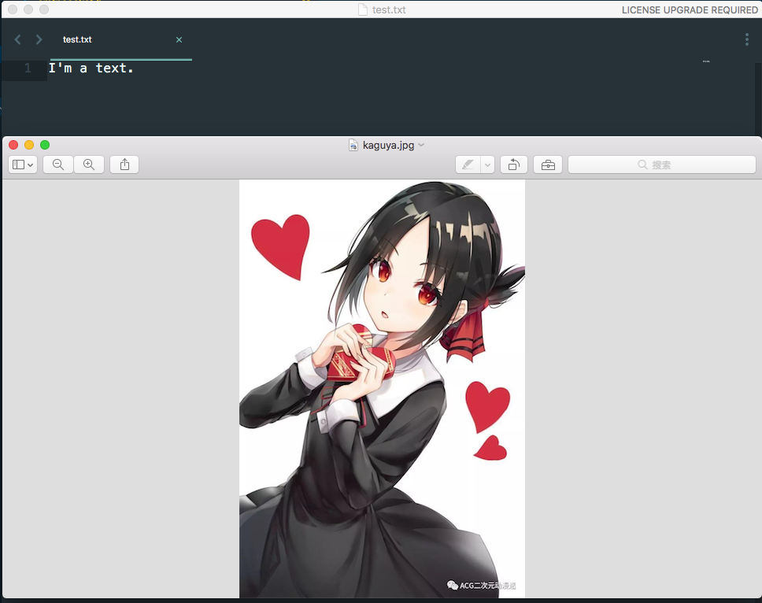
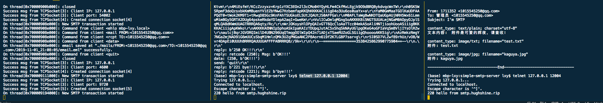

# 上机作业2：编写SMTP服务器并观察通信过程

> 在github上查看此项目。

Table of Contents
=================

   * [上机作业2：编写SMTP服务器并观察通信过程](#上机作业2编写smtp服务器并观察通信过程)
      * [一、项目结构说明与演示](#一项目结构说明与演示)
         * [项目构建](#项目构建)
         * [演示](#演示)
         * [解释](#解释)
         * [目录树](#目录树)
      * [二、SMTP server代码分析](#二smtp-server代码分析)
         * [common](#common)
         * [main](#main)
         * [tcpsocket](#tcpsocket)
         * [smtpsocket](#smtpsocket)
            * [applySocket()](#applysocket)
            * [processSMTPequest(TCPSocket *)](#processsmtpequesttcpsocket-)
            * [onXXX()](#onxxx)
            * [onRAWDATA()](#onrawdata)
      * [三、python辅助脚本分析](#三python辅助脚本分析)
         * [send_mail.py](#send_mailpy)
         * [decode_email.py](#decode_emailpy)
      * [注意](#注意)
      * [引用与致谢](#引用与致谢)

## 一、项目结构说明与演示

项目在`macos`上开发，使用`make`进行建构管理。过程在`terminal`上呈现。

支持并发访问，邮件存储，多附件提取，并且有良好的项目架构。wakatime上记录开发时间为16小时。


### 项目构建

```bash
# dependency: boost. 请在makefile中正确链接。
make clean
make
# 并要求python3
```

### 演示

项目分为三个部分：
1. 完全由c++开发的smtp server.
2. 邮件发送脚本`send_mail.py`
3. eml解析脚本`decode_email.py`

在完成一次完整的交互后，预期的效果如下。此例中，socket[3]是welcome_socket，socket[4]是connect_socket。每个connect_socket负责一个独立的smtp访问，被运行在一个新的线程上，本例中该线程的唯一标识是`[0x7000042c2000]`。每个线程的独立信息，如发件人收件人信息，亦通过线程标识寻找（存储与unordered_map中）。


> 时间与后面截图中不同，因为后来才加这张图。

```bash
# smtp server
# (base) mbp-lxy:simple-smtp-server lxy$ make test
Success msg from TCPSocket[3]: Creating socket [3]
Success msg from TCPSocket[3]: Trying to bind socket, attempts: 1 / 10
Success msg from TCPSocket[3]: Bind success! 
Success msg from TCPSocket[3]: Start Listening...
Success msg from TCPSocket[3]: Client IP: 127.0.0.1
Success msg from TCPSocket[3]: Client port: 25046
Success msg from TCPSocket[4]: Created connection socket[4]
On thread[0x7000042c2000]: New SMTP transaction started
On thread[0x7000042c2000]: Command from client <ehlo mbp-lxy.local>
On thread[0x7000042c2000]: Command from client <mail FROM:<1015545250@qq.com>>
On thread[0x7000042c2000]: Command from client <rcpt TO:<1015545250@qq.com>>
On thread[0x7000042c2000]: Command from client <data>
On thread[0x7000042c2000]: email saved at "./mails/FROM:<1015545250@qq.com>/TO:<1015545250@qq.com>/2019-11-01_20:28:11/email.eml" successfully.
On thread[0x7000042c2000]: Command from client <quit>
On thread[0x7000042c2000]: closed
```

`decode_email.py`对`./mails/`下所有`.eml`文件递归的解析。以下是对其中一篇文件解析的结果，可以看出正确的解析了邮件头，正文，以及两个附件。




```bash
# decoding...
# (base) mbp-lxy:simple-smtp-server lxy$ python decode_email.py 
-------------------------------------------------------------------
Decoding: ./mails/FROM:<1015545250@qq.com>/TO:<1015545250@qq.com>/2019-11-01_20:28:11/email.eml

From: 1711352 <1015545250@qq.com>
To: 管理员 <1015545250@qq.com>
Subject: I'm SMTP

content_type: text/plain; charset="utf-8"
文本内容:  附件是可爱的辉夜，请查收！

content_type: image/txt; filename="test.txt"
附件: test.txt

content_type: image/jpg; filename="kaguya.jpg"
附件: kaguya.jpg

--------------------------------End--------------------------------
```

多线程演示：同时向端口发送两个telnet链接。最左终端为smtp server，可以看见创建了socket[4], socket[5]，被不同的线程接收。中与右两个终端发送了两个`telenet 127.0.0.1 12004`，都收到了server的回应。

> smtp server设置在了12004端口



### 解释

在开启server后运行用`send_mail.py`发送一个带有正文与多附件的邮件给smtp server。smtp server将合法的邮件存储于`./mails/`下，以发件人、收件人与邮件发送的时间戳作为路径，的`email.eml`文件。

之后对它做解析。由于MIME格式文件的解析跟smtp没有任何关系，进而和网络没有任何关系，所以使用`decode_email.py`直接进行文件（`./mails/`下所有`.eml`格式文件）信息的抽取、附件提取，保存至对应的文件夹下。

> 注：smtp协议包含的是`helo`, `data`, `quit`这些SMTP命令以及这些命令时返回码的含义。
> 在data命令后，发送Raw Data过程中，发送的具体的邮件内容格式，是和smtp协议没有关系的，它此时仅负责传输。
> 邮件的解析是由解析器（客户端）完成，并呈现至用户的。
> 所以本次自作业解析部分使用Python完成，还请老师理解。
> > 附，有同学说诸如非对称加密的协议，加密解码是要由协议规定的；那是一定的，但smtp协议本身没有加密任务呀。如果愿意，可以在其上进一步封装。

### 目录树

项目目录树如下。
```shell
.
├── Makefile
├── README.md
├── common.cpp 
├── common.h  # 存放公共头文件以及utils函数
├── decode_email.py  # 解码用
├── images
│   └── kaguya.jpg  # 发送的图片
├── mails  # smtp server 用于存放收到的邮件，以及decode后的附件
│   └── FROM:<1015545250@qq.com>
│       └── TO:<1015545250@qq.com>
│           ├── 2019-11-01_14:40:06
│           │   ├── email.eml
│           │   └── kaguya.jpg
│           ├── 2019-11-01_14:44:46
│           │   ├── email.eml
│           │   └── kaguya.jpg
│           └── ...
├── main  
├── main.cpp  # 程序入口
├── report.md  
├── send_mail.py  # 发送邮件脚本
├── smtpsocket.cpp  # 
├── smtpsocket.h  # SmtpSocket 定义头文件
├── tcpsocket.cpp
├── tcpsocket.h  # 封装的 TCPSocket 头文件
└── text
    └── test.txt  # 发送的txt文件
```

## 二、`SMTP server`代码分析

### `common`

放置使用的头文件，以及公用的utils函数。
```cpp
// common.h
// common.cpp 即 utils函数的定义，不再展示。
#ifndef COMMON_H
#define COMMON_H
#include <iostream>
#include <sys/socket.h>
#include <stdlib.h>
#include <stdio.h>
#include <string.h>
#include <unistd.h>
#include <sys/types.h>
#include <netinet/in.h>
#include <arpa/inet.h>
#include <ctime>
#include <time.h>
#include <thread>
#include <list>
#include <functional>
#include <fstream>
#include <boost/filesystem.hpp>
#include <unordered_map>
#include <ctime>
#include <time.h>
using namespace std;

string to_upper(string str);  // 将string大写，用于SMTP命令匹配
bool hasEnding(string const &str, string const &end);  // 用于找 “.\r\n”
void findAndReplaceAll(std::string &data, std::string toSearch, std::string replaceStr); 
const std::string currentDate();
const std::string currentTime();

#endif
```

### `main`

没什么特别的。
```cpp
// #include<iostream>
#include "smtpsocket.h"
using namespace std;

int main()
{
    unsigned bind_port = 12004;
    SMTPServer smpt_server(bind_port); // default: localhost
    smpt_server.applySocket();
}
```

### `tcpsocket`

`TCPSocket.h`对原生的`socket`进行了封装。最主要的是，对`welcome_socket`与`connect_socket`进行了区分，在`welcome_socket->accpet()`后直接返回已经配置好的`connect_socket`，方便了`SMTPServer`为每个SMTP连接建立一个新的线程。

```cpp
#include "common.h"
#ifndef STATUS_OK
#define STATUS_OK false
#define STATUS_FAIL true
#endif
#define UNINITIALIZED 0 // TCPSocket类型宏
#define WELCOME_SOCKET 1
#define CONNECT_SOCKET 2

using namespace std;

class TCPSocket
{
public:
    TCPSocket(unsigned bind_port);
    ~TCPSocket(){::close(_socket);successMsg("close()");}
    int listen();
    int bind();
    TCPSocket* accept();
    string rcv();
    // char* rcvRaw();
    int send(string msg);//connected, ok
    int send(char *buf, int size);
    int close();
    void setSocketAndClientAddr(int _socket, unsigned bind_port, string ip = "127.0.0.1");

private:
    void successMsg(string msg);
    void errorMsg(string msg);
    int SOCKET_TYPE = UNINITIALIZED;
    int set(unsigned client_port , string ip = "127.0.0.1");
    int testBind(int times=10);
    int _socket;
    bool binded = false;
    bool connected = false;
    unsigned bind_port;
    struct sockaddr_in server_addr;
    struct sockaddr_in client_addr;
    char read_buffer[1024];
};
```

### `smtpsocket`

SMTPServer稍微复杂。首先为方便后续使用，定义Command类，将每个SMTP command的关键字与其对应callback绑定。定义SMTPClientState用于记录每个独立的smtp访问的mailfrom信息与recpto信息。（如果增加AUTH功能，可以在其中进行补充）。

每个SMTPServer拥有一个welcome_socket，用于握手并生成connect_socket。thread_map用于跟踪每个线程与其SMTPClientState（也即每个smtp连接和它的独立信息）。

`processSMTPequest(TCPSocket*)`用于开启一个smtp连接。为每一次它的调用创建一个新的线程。

```cpp
#include "tcpsocket.h"
#include "common.h"
#define mem
#define func
#define def
// #define NUMBER_CONNECTIONS 8
#define STATUS_OK false
#define STATUS_FAIL true
#define STATUS_FINISHED true

using namespace std;

class SMTPServer
{
private def : 
    struct Command
    {
        string command;
        std::function<bool(TCPSocket *, string)> callback;
    };

    struct SMTPClientState
    {
        string mailFrom;
        string recpTo;
    };

public func:
    explicit SMTPServer(unsigned bind_port=12005);
    ~SMTPServer();
    bool applySocket();


private mem : 
    unsigned connection_count = 0;
    thread _th;
    // bool acceptNewConnection = true;
    TCPSocket* welcome_socket;
    unordered_map<std::thread::id, SMTPClientState> thread_map;
    Command commands[7] = {
        {string("DATA"), std::bind(&SMTPServer::onDATA, this, std::placeholders::_1, std::placeholders::_2)},
        {string("HELO"), std::bind(&SMTPServer::onHELO, this, std::placeholders::_1, std::placeholders::_2)},
        {string("EHLO"), std::bind(&SMTPServer::onEHLO, this, std::placeholders::_1, std::placeholders::_2)},
        {string("MAIL"), std::bind(&SMTPServer::onMAIL, this, std::placeholders::_1, std::placeholders::_2)},
        {string("RCPT"), std::bind(&SMTPServer::onRCPT, this, std::placeholders::_1, std::placeholders::_2)},
        {string("RSET"), std::bind(&SMTPServer::onRSET, this, std::placeholders::_1, std::placeholders::_2)},
        {string("QUIT"), std::bind(&SMTPServer::onQUIT, this, std::placeholders::_1, std::placeholders::_2)},
    };

private func: 
    // bool relisten(){this->welcome_socket->listen();}
    void processSMTPequest(TCPSocket *);
    //smtp actions
    bool onGREET(TCPSocket *);
    bool onHELO(TCPSocket *, string);
    bool onEHLO(TCPSocket *, string);
    bool onMAIL(TCPSocket *, string);
    bool onRCPT(TCPSocket *, string);
    bool onDATA(TCPSocket *, string);
    bool onRSET(TCPSocket *, string);
    bool onQUIT(TCPSocket *, string);
    bool onWRONGCMD(TCPSocket *);
    bool onRAWDATA(TCPSocket *);
};
```

#### `applySocket()`

调用起点。

```cpp
bool SMTPServer::applySocket()
{
    int listen_code = this->welcome_socket->listen();
    if(listen_code == STATUS_FAIL){
        cout << "TERMINATING!" <<endl;
        return false;
    }

    while(this->connection_count <= NUMBER_CONNECTIONS){
        TCPSocket* connect_socket = this->welcome_socket->accept();
        // 为每一个访问创建一个新的线程。
        thread* _th = new std::thread(&SMTPServer::processSMTPequest, this, connect_socket);
    }
    return true;
}
```

#### `processSMTPequest(TCPSocket *)`

进行连接状态的检查，之后根据发来的SMTP command，进行对应的callback。

注意，在发送data命令后，文件流不在这里处理。

```cpp
void SMTPServer::processSMTPequest(TCPSocket * connect_socket)
{
    auto thread_id = std::this_thread::get_id();
    cout << "On thread[" << thread_id << "]: "
         << "New SMTP transaction started"<< endl;
    this->onGREET(connect_socket);
    while(true) { // maybe set a timer
        string cmd = connect_socket->rcv();
        if (cmd == "")
        {
            cout << "thread" << thread_id << " closed\n";
            return;
        }
        findAndReplaceAll(cmd, "\n", "");
        findAndReplaceAll(cmd, "\r", "");
        cout << "On thread[" << thread_id << "]: "<< "Command from client <" << cmd << ">" << endl;
        bool GOOD_CMD = false;
        for(auto c:commands){
            // cout << c.command << endl;
            if(to_upper(cmd.substr(0,4))==c.command) {
                bool status = c.callback(connect_socket, cmd);
                if(status == STATUS_FINISHED) // QUIT, STATUS_FAIL ==> STATUS_FINISHED
                {
                    cout << "On thread[" << thread_id << "]: closed\n";
                    return;
                }
                else 
                {
                    GOOD_CMD = true;
                    break;
                }
            }
        }
        if(GOOD_CMD == false) {
            this->onWRONGCMD(connect_socket);
        }
    }
    cout << "On thread[" << thread_id << "]: closed\n";
    return;
}
```

#### `onXXX()`

很简单，就是做一定的状态处理，并让connect_socket返回对应的内容。如：
```cpp
bool SMTPServer::onMAIL(TCPSocket * connect_socket, string cmd)
{
    string from = cmd.substr(5);
    auto thread_id = std::this_thread::get_id();
    if (this->thread_map.find(thread_id) == thread_map.end())
    {
        thread_map.insert(std::make_pair(thread_id, SMTPClientState()));
    }
    // 记录邮件发送者。
    this->thread_map[thread_id].mailFrom = from;

    connect_socket->send("250 hello!!!\r\n");
    return STATUS_OK;
}
```

```cpp
bool SMTPServer::onDATA(TCPSocket * connect_socket, string)
{
    auto thread_id = std::this_thread::get_id();
    if (this->thread_map.find(thread_id) == thread_map.end())
    {
        //如果之前没有发过mail from, rcpt to. 只做了很基础的检查。
        connect_socket->send("500 Info Incomplete\r\n");
        return false;
    }
    connect_socket->send("354 End data with <CR><LF>.<CR><LF>\r\n");
    this->onRAWDATA(connect_socket); // 接收文件
    connect_socket->send("250 OK!!!\r\n");
    return STATUS_OK;
}
```

```cpp
bool SMTPServer::onQUIT(TCPSocket * connect_socket, string)
{
    connect_socket->send("221 bye!!!\r\n");
    connect_socket->close();
    return STATUS_FINISHED;
}
```

#### `onRAWDATA()`

接收文件也因为对TCPSocket的封装变得简单了。

```cpp
bool SMTPServer::onRAWDATA(TCPSocket * connect_socket)
{
    string data = "";
    auto thread_id = std::this_thread::get_id();
    SMTPClientState client_state = this->thread_map[thread_id];
    string from = client_state.mailFrom;
    string to = client_state.recpTo;
    while(true)
    {
        string bytes = connect_socket->rcv();
        if (bytes == "")
        {
            cout << " On thread[" << thread_id <<"]: "<<"socket closed by client" << endl;
            return STATUS_OK;
        }

        if (hasEnding(bytes, ".\r\n")) //data 读取完毕，write to a file
        {
            string dir = "./mails/" + from + "/" + to + "/" + string(currentDate()) + "_" + string(currentTime()) + "/";
            boost::filesystem::create_directories(dir);
            findAndReplaceAll(bytes, "\r\n", "\n");
            data += bytes.substr(0, bytes.length()-3);
            ofstream file;
            string filename = dir + "email.eml";
            file.open(filename, ios::out | ios::trunc);
            file << data;
            file.close();
            cout << "On thread[" << thread_id << "]: "<< "email saved at \""<<filename<<"\" successfully." << endl;
            return STATUS_OK;
        }
        else
        {
            // 就是对mac 和 windows的差异进行一下修正。
            findAndReplaceAll(bytes, "\r\n", "\n");
            data += bytes;
        }
    }
}
```

## 三、`python`辅助脚本分析

### `send_mail.py`

使用`email`库，`smtplib`库发送邮件。
```python
'''
发送一个带文本与图片附件的email
'''
import smtplib
from email import encoders
from email.header import Header
from email.mime.base import MIMEBase
from email.mime.multipart import MIMEMultipart
from email.mime.text import MIMEText
from email.utils import parseaddr, formataddr

def _format_addr(s):
    name, addr = parseaddr(s)
    return formataddr((Header(name, 'utf-8').encode(), addr))

from_addr = "1015545250@qq.com" # input('From: ')
to_addr = "1015545250@qq.com"
smtp_server = "127.0.0.1"

msg = MIMEMultipart()
msg['From'] = _format_addr('1711352 <%s>' % from_addr)
msg['To'] = _format_addr('管理员 <%s>' % to_addr)
msg['Subject'] = Header('I\'m SMTP', 'utf-8').encode()

msg.attach(MIMEText('附件是可爱的辉夜，请查收！', 'plain', 'utf-8'))

with open('./text/test.txt', 'rb') as f:
    # 设置附件的MIME和文件名
    mime = MIMEBase('image', 'txt', filename='test.txt')
    # 附件的必要的头信息
    mime.add_header('Content-Disposition', 'attachment', filename='test.txt')
    mime.add_header('Content-ID', '<0>')
    mime.add_header('X-Attachment-Id', '0')
    # 读入内容并解码
    mime.set_payload(f.read())
    encoders.encode_base64(mime)
    msg.attach(mime)

with open('./images/kaguya.jpg', 'rb') as f:
    # 设置附件的MIME和文件名
    mime = MIMEBase('image', 'jpg', filename='kaguya.jpg')
    # 附件的必要的头信息
    mime.add_header('Content-Disposition', 'attachment', filename='kaguya.jpg')
    mime.add_header('Content-ID', '<0>')
    mime.add_header('X-Attachment-Id', '0')
    # 读入内容并解码
    mime.set_payload(f.read())
    encoders.encode_base64(mime)
    msg.attach(mime)

server = smtplib.SMTP(smtp_server, 12004) 
server.set_debuglevel(1)
# server.login(from_addr, password)
server.sendmail(from_addr, [to_addr], msg.as_string())  
server.quit()
```

### `decode_email.py`

自`./mails`以下，所有`.eml`文件，全部以MIME格式解析（解码）。其中重要的头提取并显示，显示正文，并将每一个附件提取出，保持文件名不变。

```python
'''
解码附件

TODO 可视化: https://zhuanlan.zhihu.com/p/22619896
'''
import os
import email
from email import policy
from email.header import Header, decode_header
from email.parser import BytesParser
import glob

def decode_eml(dir, filename):  # './xxx/'
    print('-------------------------------------------------------------------')
    print ('Decoding: ' + dir + filename + "\n")
    # with open(dir + filename, 'r') as fp:
    fp = open(dir + filename, 'rb')  # b => bytes
    msg = BytesParser(policy=policy.default).parse(fp)
    # 提取重要的邮件头信息
    _from = msg.get('From')
    _to = msg.get('To')
    _subject = msg.get('Subject')
    print('From: ' + _from)
    print('To: ' + _to)
    print('Subject: ' + _subject + '\n')

    fp = open(dir + filename, 'r')
    msg = email.message_from_file(fp)
    for par in msg.walk():  # 对于每一个MIME块 
        if not par.is_multipart():     
            content_type = par.get('Content-Type')
            print('content_type: ' + content_type)
            name = par.get_param('filename')
            if name:
                h = Header(name)  # 解码奇怪的文件名
                dh = decode_header(h)
                fname = dh[0][0]  # 附件名
                print('附件:', str(fname, encoding='utf-8') + '\n')
                data = par.get_payload(decode=True)
                try:
                    f = open(dir + str(fname, encoding='utf-8'), 'wb')  # 注意一定要用wb来打开文件，因为附件一般都是二进制文件
                    f.write(data)
                    f.close()
                except:
                    print('error: 附件名含非法字符，存为tmp')
                    f = open('tmp', 'wb')
                    f.write(data)
                    f.close()
            else:
                print('文本内容: ', str(par.get_payload(decode=True), encoding='utf-8') + '\n')

    fp.close()
    print('--------------------------------End--------------------------------\n')

def decode_all(path):
    for (dirpath, dirnames, filenames) in os.walk(path): 
        for filename in filenames:
            if filename.endswith('.eml'):  # 对于每一个`.eml`文件
                decode_eml(dirpath+"/", filename)
                
if __name__ == "__main__":
    decode_all('./mails/')
```

## 注意

1. telnet使用：telnet ctrl+] quit 退出连接
2. nslookup, 查dns
3. vscode 真好用
4. Makefile链接boost库
5. 注意多个项目时头文件的引用，和Makefile编译对象（解决`duplicated symbol`）
6. c++11好好用

## 引用与致谢

1. [link boost in makefile](https://stackoverflow.com/questions/1305530/including-boost-libraries-in-make-files)

2. greatly inspired by [SunriseFox/very-simple-smtp-server](https://github.com/sunrisefox/very-simple-smtp-server)

3. [telnet](https://www.jianshu.com/p/cb846c926edc)

4. [python3发送邮件](https://www.liaoxuefeng.com/wiki/1016959663602400/1017790702398272)

5. [非常可爱的辉夜小姐姐](https://www.bilibili.com/bangumi/play/ss26274)

6. others...

> 很有很多欠缺，不过真的学到了一些内容！